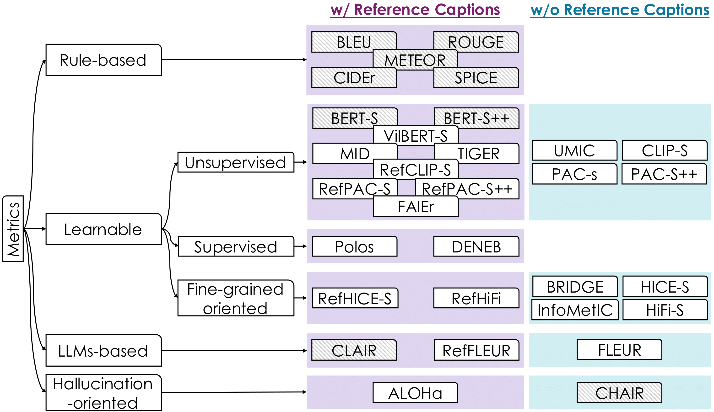
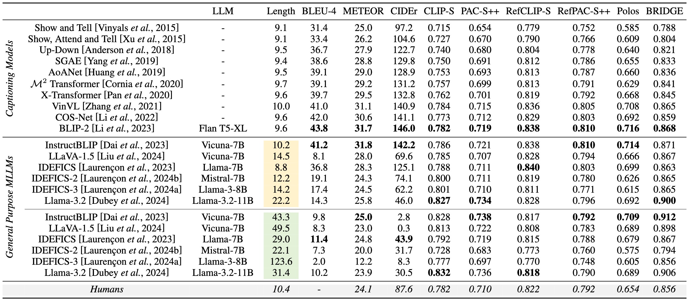
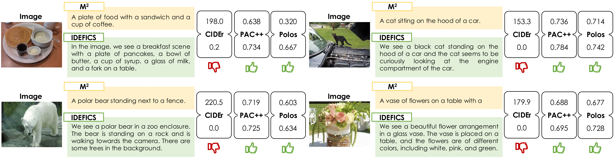

# Image Captioning Evaluation [](https://awesome.re)
This repository contains a curated list of research papers and resources focusing on image captioning evaluation.

<p align="center">
    
</p>


❗ Latest Update: 18 March 2025.
❗This repo is a work in progress. New updates coming soon, stay tuned!! :construction:

## 👩‍💻 🔜 Code for Reproducing Metric Scores 

We leverage publicly available codes and have designed a unified framework that enables the reproduction of all metrics within a single repository.

**🔜 Coming soon! 🔜**

## 🔥🔥 Our Survey
<div align="center">
  <h2> Image Captioning Evaluation in the Age of Multimodal LLMs:<br>Challenges and Future Perspectives</h2>

  **Authors:** 
[**Sara Sarto**](https://scholar.google.com/citations?user=Y-DaVvEAAAAJ&hl=it),
[**Marcella Cornia**](https://scholar.google.com/citations?user=DzgmSJEAAAAJ&hl=it&oi=ao),
[**Rita Cucchiara**](https://scholar.google.com/citations?user=OM3sZEoAAAAJ&hl=it&oi=ao)


<a href="https://pytorch.org/get-started/locally/"></a>
[](https://arxiv.org/abs/??)
</div>

Please cite with the following BibTeX:
```
@inproceedings{sarto2025survey,
  title={{Image Captioning Evaluation in the Age of Multimodal LLMs: Challenges and Future Perspectives}},
  author={Sarto, Sara and Cornia, Marcella and Cucchiara, Rita},
  booktitle={arxiv}
  year={2025}
}
```


<p align="center">
    
</p>

<p align="center">
    
</p>

# 📚 Table of Contents

- **The Evolution of Captioning Metrics**
  - <details>
      <summary><strong>Rule-based Metrics</strong></summary>
  
     | **Year** | **Conference / Journal** | **Title** | **Authors** | **Links** |  
      |:--------:|:----------------------:|:-----------------------------------------------:|:-----------------:|:------------------------------------------------------------:|  
      | 2002 | ACL | BLEU: A method for automatic evaluation of machine translation | *Kishore Papineni et al.* | [📜  Paper](https://aclanthology.org/P02-1040.pdf) |
      | 2004 | ACLW | ROUGE: A package for automatic evaluation of summaries | *Chin-Yew Lin* | [📜 Paper](https://aclanthology.org/W04-1013.pdf) |  
      | 2005 | ACLW | METEOR: An automatic metric for MT evaluation with improved correlation with human judgments | *Satanjeev Banerjee et al.* | [📜 Paper](https://aclanthology.org/W05-0909.pdf) |  
      | 2015 | CVPR | CIDEr: Consensus-based Image Description Evaluation | *Ramakrishna Vedantam et al.* | [📜 Paper](https://openaccess.thecvf.com/content_cvpr_2015/papers/Vedantam_CIDEr_Consensus-Based_Image_2015_CVPR_paper.pdf) |  
      | 2016 | ECCV | SPICE: Semantic Propositional Image Caption Evaluation | *Peter Anderson et al.* | [📜 Paper](https://arxiv.org/pdf/1607.08822) |
    
  </details>

    - **Learnable Metrics**
        - <details>
            <summary>Unsupervised Metrics</summary>
            
            | **Year** | **Conference / Journal** | **Title** | **Authors** | **Links** |  
            |:--------:|:----------------------:|:-----------------------------------------------:|:-----------------:|:------------------------------------------------------------:|  
            | 2019 | EMNLP | TIGEr: Text-to-Image Grounding for Image Caption Evaluation | *Ming Jiang et al.* | [📜 Paper](https://arxiv.org/pdf/1909.02050) |  
            | 2020 | ICLR | BERTScore: Evaluating Text Generation with BERT | *Tianyi Zhang et al.* | [📜 Paper](https://openreview.net/pdf?id=SkeHuCVFDr) |  
            | 2020 | ACL | Improving Image Captioning Evaluation by Considering Inter References Variance | *Yanzhi Yi et al.* | [📜 Paper](https://aclanthology.org/2020.acl-main.93.pdf) |  
            | 2020 | EMNLP | ViLBERTScore: Evaluating Image Caption Using Vision-and-Language BERT | *Hwanhee Lee et al.* | [📜 Paper](https://aclanthology.org/2020.eval4nlp-1.4.pdf) |  
            | 2021 | EMNLP | CLIPScore: A Reference-free Evaluation Metric for Image Captioning | *Jack Hessel et al.* | [📜 Paper](https://arxiv.org/pdf/2104.08718) |  
            | 2021 | CVPR | FAIEr: Fidelity and Adequacy Ensured Image Caption Evaluation | *Sijin Wang et al.* | [📜 Paper](https://openaccess.thecvf.com/content/CVPR2021/papers/Wang_FAIEr_Fidelity_and_Adequacy_Ensured_Image_Caption_Evaluation_CVPR_2021_paper.pdf) |  
            | 2021 | ACL | UMIC: An Unreferenced Metric for Image Captioning via Contrastive Learning | *Hwanhee Lee et al.* | [📜 Paper](https://arxiv.org/pdf/2106.14019) |  
            | 2022 | NeurIPS | Mutual Information Divergence: A Unified Metric for Multimodal Generative Models | *Jin-Hwa Kim et al.* | [📜 Paper](https://arxiv.org/pdf/2205.13445) |  
            | 2023 | CVPR | PAC-S: Improving CLIP for Image Caption Evaluation via Positive Augmentations | *Sara Sarto et al.* | [📜 Paper](https://arxiv.org/pdf/2303.12112) |  

          </details>
          
        - <details>
            <summary>Supervised Metrics</summary>
            
            | **Year** | **Conference / Journal** | **Title** | **Authors** | **Links** |  
            |:--------:|:----------------------:|:-----------------------------------------------:|:-----------------:|:------------------------------------------------------------:|  
            | 2024 | CVPR | Polos: Multimodal Metric Learning from Human Feedback for Image Captioning | *Yuiga Wada et al.* | [📜 Paper](https://arxiv.org/pdf/2402.18091) |  
            | 2024 | ACCV | DENEB: A Hallucination-Robust Automatic Evaluation Metric for Image Captioning | *Kazuki Matsuda et al.* | [📜 Paper](https://arxiv.org/pdf/2409.19255) |  

      </details>
    
        - <details>
            <summary>Fine-grained Oriented Metrics</summary>
  
           | **Year** | **Conference / Journal** | **Title** | **Authors** | **Links** |  
            |:--------:|:----------------------:|:-----------------------------------------------:|:-----------------:|:------------------------------------------------------------:|  
            | 2023 | ACL | InfoMetIC: An Informative Metric for Reference-free Image Caption Evaluation | *Anwen Hu et al.* | [📜 Paper](https://arxiv.org/pdf/2305.06002) |  
            | 2024 | ACM MM | HICEScore: A Hierarchical Metric for Image Captioning Evaluation | *Zequn Zeng et al.* | [📜 Paper](https://arxiv.org/pdf/2407.18589) |  
            | 2024 | ECCV | BRIDGE: Bridging Gaps in Image Captioning Evaluation with Stronger Visual Cues | *Sara Sarto et al.* | [📜 Paper](https://arxiv.org/pdf/2407.20341) |  
            | 2024 | ECCV | HiFi-Score: Fine-Grained Image Description Evaluation with Hierarchical Parsing Graphs | *Ziwei Yao et al.* | [📜 Paper](https://www.ecva.net/papers/eccv_2024/papers_ECCV/papers/07957.pdf) |  

        </details>

    - <details>
      <summary><strong>LLMs-based Metrics</strong></summary>
  
        | **Year** | **Conference / Journal** | **Title** | **Authors** | **Links** |
        |:--------:|:----------------------:|:-----------------------------------------------:|:-----------------:|:------------------------------------------------------------:|
        | 2023 | EMNLP | CLAIR: Evaluating Image Captions with Large Language Models | *David Chan et al.* | [📜 Paper](https://arxiv.org/pdf/2310.12971) |  
        | 2024 | ACL | FLEUR: An Explainable Reference-Free Evaluation Metric for Image Captioning Using a Large Multimodal Model | *Yebin Lee et al.* | [📜 Paper](https://arxiv.org/pdf/2406.06004) |  
    </details>

    - <details>
      <summary><strong>Hallucinations-based Metrics</strong></summary>
  
      | **Year** | **Conference / Journal** | **Title** | **Authors** | **Links** |  
        |:--------:|:----------------------:|:-----------------------------------------------:|:-----------------:|:------------------------------------------------------------:|  
        | 2018 | EMNLP | Object Hallucination in Image Captioning | *Anna Rohrbach et al.* | [📜 Paper](https://arxiv.org/pdf/1809.02156) |  
        | 2024 | NAACL | ALOHa: A New Measure for Hallucination in Captioning Models | *Suzanne Petryk et al.* | [📜 Paper](https://arxiv.org/pdf/2404.02904) |  
</details>

    

 


- **Datasets & Benchmarks 📂📎**
    - <details>
        <summary>Correlation with Human Judgment</summary>
      
        - [Flickr8k-Expert and Flickr8k-CF](https://www.ijcai.org/Proceedings/15/Papers/593.pdf)
        - [Composite](https://arxiv.org/pdf/1511.03292)
        - [Polaris](https://huggingface.co/datasets/yuwd/Polaris)
        - [Nebula](https://arxiv.org/pdf/2409.19255)
        
      </details>
   - <details>
        <summary>Pairwise Ranking </summary>
      
        - [Pascal50-S](https://arxiv.org/pdf/1411.5726)
        
      </details>
    - <details>
        <summary>Sensitivity to Object Hallucinations</summary>
      
        - [FOIL dataset](https://foilunitn.github.io/)
       
      </details>
   
    </details>


# How to Contribute 🚀

1. Fork this repository and clone it locally.
2. Create a new branch for your changes: `git checkout -b feature-name`.
3. Make your changes and commit them: `git commit -m 'Description of the changes'`.
4. Push to your fork: `git push origin feature-name`.
5. Open a pull request on the original repository by providing a description of your changes.

This project is in constant development, and we welcome contributions to include the latest research papers in the field or report issues 💥.
